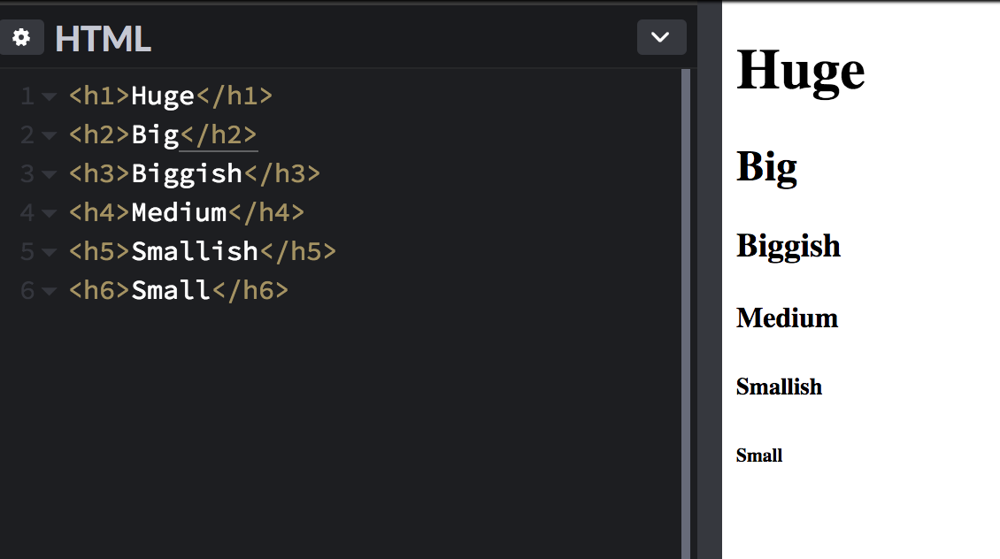
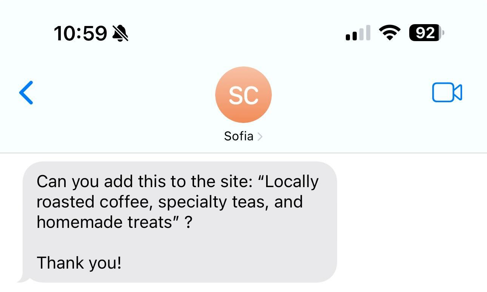
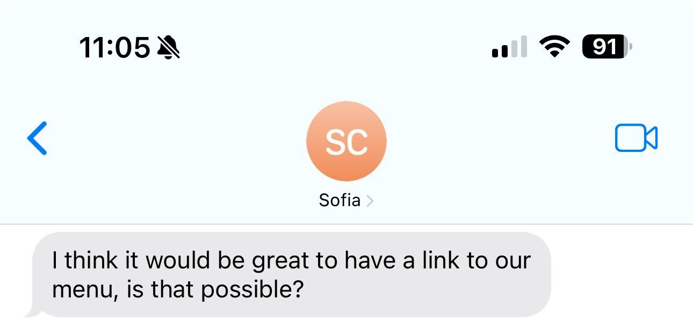
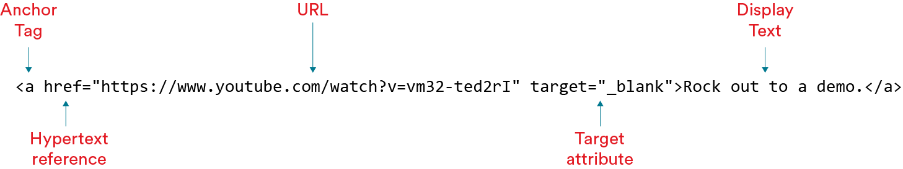
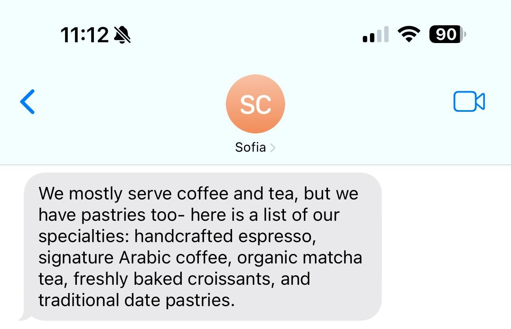
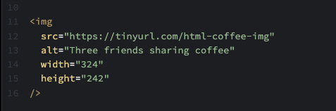

<textarea id="source">

<h1 class="slide-header">Adding Content to a Web Page</h1>

<span id=time-estimate class="color-grey-500">30 mins</span>

<p id="lesson-description">
With templates like the HTML boilerplate, it’s easy to put the shell of an HTML file into place. But populating that page with content? That’s up to you. In this lesson, we’ll show you how.
</p>

<h5 id="topics-header" class="color-grey-500">Topics</h5>

Writing Text in HTML

<hr>

Adding Links in HTML

<hr>

Creating Lists in HTML

<hr>

Inserting Images in HTML

<hr>

<a href="./assets/adding_content_to_a_web_page_study_guide.pdf" target="_blank" download="adding_content_to_a_web_page_study_guide.pdf" class="ant-btn" data-trackable="true" data-track-category="study guide" data-track-section="lesson page" data-track-action="download study guide"><span role="img" class="anticon"><svg viewBox="0 0 16 16" width="1em" height="1em" fill="currentColor" aria-hidden="true" focusable="false" class=""><g class="download_svg__nc-icon-wrapper"><path d="M8 12c.3 0 .5-.1.7-.3L14.4 6 13 4.6l-4 4V0H7v8.6l-4-4L1.6 6l5.7 5.7c.2.2.4.3.7.3z"></path><path data-color="color-2" d="M1 14h14v2H1z"></path></g></svg></span><span> Download Study Guide</span></a>

---

<h1 class="slide-header">Learning Objectives</h1>

<p>By the end of this lesson, you'll be able to:</p>

<ul>
  <li>Add text elements to an HTML file.</li>
  <li>Add links to an HTML file.</li>
  <li>Add lists to an HTML file.</li>
  <li>Add images to an HTML file.</li>
</ul>

---

<h1 class="slide-header">Adding Headings</h1>

All websites should start with a heading — something that tells users what they’re seeing.

There are a series of these heading tags available, from `<h1>` through `<h6>`. As the numbers increase, the text gets smaller. (Think about it this way: The `<h1>` is the most important element on the page, the `<h2>` is second-most important, and so on down the line.)

It’s important to use heading levels in order without skipping (such as jumping from `<h1>` to `<h3>`). Headings help organize content for both users and search engines. If you want to change the size of a heading for design reasons, you can do that using CSS later — but for now, focus on using them in the correct order for structure.



---

<h1 class="slide-header">Adding a Heading</h1>

Let’s pick up where we left off last lesson, when we added an `<h1>` to the Café Aurora website — the name of the café.

Most sites should have only one `<h1>` tag, as it’s supposed to indicate the most important thing on the page. So, let’s add another heading below that. Something to give visitors a warm introduction to the café’s atmosphere.

Let’s use an `<h2>` tag since it’s the next level of importance.

**1. Create an `<h2>` and add the text: `Bringing people together over artisanal coffee and fresh pastries.`**

Remember to click the **View Test Results** button to run the tests, which will confirm that your code is correct.

<iframe   sandbox="allow-scripts allow-top-navigation allow-top-navigation-by-user-activation allow-forms allow-popups allow-same-origin"  height="400" style="width: 100%;" scrolling="no" title="Adding a Heading" src="https://codepen.io/GAmarketing/embed/vEYxWvj?default-tab=html%2Cresult&editable=true" frameborder="no" loading="lazy" allowtransparency="true" allowfullscreen="true">
  See the Pen <a href="https://codepen.io/GAmarketing/pen/vEYxWvj">
  Adding Zelda's Headings</a> by General Assembly (<a href="https://codepen.io/GAmarketing">@GAmarketing</a>)
  on <a href="https://codepen.io">CodePen</a>.
</iframe>

---

<h1 class="slide-header">Adding More Text</h1>

Your friend has been thinking about content for the new website. In fact, they just messaged you with a request:

_Can you add this to the site: "Locally roasted coffee, specialty teas, and homemade treats"? Thank you!_

<br>



---

<h1 class="slide-header">The <code>p</code> tag</h1>

Let’s add the new text content to the page. We’ll place it in a `<p>`, or “paragraph,” tag, which adds text in a smaller, more standard size than heading tags. Think of the `<p>` tag as your default option for regular text.

**1. Below the `<h1>` and `<h2>`, add a `<p>` that contains `Locally roasted coffee, specialty teas, and homemade treats.`**

Remember to click the **View Test Results** button to run the tests, which will confirm that your code is correct.

  <iframe   sandbox="allow-scripts allow-top-navigation allow-top-navigation-by-user-activation allow-forms allow-popups allow-same-origin"  height="400" style="width: 100%;" scrolling="no" title="The paragraph tag" src="https://codepen.io/GAmarketing/embed/azbJEGG?default-tab=html%2Cresult&editable=true" frameborder="no" loading="lazy" allowtransparency="true" allowfullscreen="true">
    See the Pen <a href="https://codepen.io/GAmarketing/pen/azbJEGG">
    The paragraph tag</a> by General Assembly (<a href="https://codepen.io/GAmarketing">@GAmarketing</a>)
    on <a href="https://codepen.io">CodePen</a>.
  </iframe>

---

<h1 class="slide-header">Another Message Request</h1>

Looks like we’ve got another item to add!

Your friend has reached out again, this time they said:

_I think it would be great to have a link to our menu, is that possible?_

<br>



---

<h1 class="slide-header">Adding a Hyperlink</h1>

Now, let’s add a link to the café’s menu so visitors can see what’s available:

**1. On a new line below the existing `<p>`, add another paragraph opening tag `<p>`.**

**2. Following the new `<p>` tag, add this exact code:**

**`<a href="https://www.example.com/menu" target="_blank">View our menu.</a>`**

**3. Add the `</p>` closing paragraph tag.**

Check the Result screen to see if the new text appears. The URL itself shouldn’t be displayed, only the words **“View our menu.”**

Remember to click the **View Test Results** button to run the tests, which will confirm that your code is correct.

<iframe   sandbox="allow-scripts allow-top-navigation allow-top-navigation-by-user-activation allow-forms allow-popups allow-same-origin"  height="400" style="width: 100%;" scrolling="no" title="Adding a Hyperlink" src="https://codepen.io/GAmarketing/embed/EaxWoqe?default-tab=html%2Cresult&editable=true" frameborder="no" loading="lazy" allowtransparency="true" allowfullscreen="true">
  See the Pen <a href="https://codepen.io/GAmarketing/pen/EaxWoqe">
  Adding a Hyperlink</a> by General Assembly (<a href="https://codepen.io/GAmarketing">@GAmarketing</a>)
  on <a href="https://codepen.io">CodePen</a>.
</iframe>

---

<h1 class="slide-header">The Anchor Element Tag</h1>

That was simple to add, but what does the `<a>` tag actually do? And what about that `href=` part?

Here’s the element we added:



Let’s break it down:

- The `<a>` tag stands for **anchor**. Think of it as a bridge that connects your page to another place—either somewhere on the same page or a completely different website.
- The `href` attribute stands for **hypertext reference**. This is where you tell the browser _where_ the link should go. It’s the web address (URL) that the link points to.
- The `target` attribute is an optional extra, but it's useful! Setting `target="_blank"` tells the browser to **open the link in a new tab** instead of replacing your current page. If we don’t include this, the link will open in the same window, taking users away from our site.
- Finally, we add the **display text**—this is what visitors actually see and click on instead of a long, messy URL.

---

<h1 class="slide-header">Add Your Own Link</h1>

Your turn!

Your friend’s café has received some great reviews, and you think it would be a great idea to share them on the website.

**1. Add a new hyperlink to our HTML file inside of a new paragraph element.**

**2. Link to `https://www.example.com/reviews` using the display text `See what our customers are saying.`**

**3. Make sure to set the target attribute to `_blank` so that your link opens in a new browser window.**

Check the Result window to ensure that everything has rendered correctly!

Remember to click the **View Test Results** button to run the tests, which will confirm that your code is correct.

<iframe   sandbox="allow-scripts allow-top-navigation allow-top-navigation-by-user-activation allow-forms allow-popups allow-same-origin"  height="400" style="width: 100%;" scrolling="no" title="Add Your Own Link" src="https://codepen.io/GAmarketing/embed/PwopQJW?default-tab=html%2Cresult&editable=true" frameborder="no" loading="lazy" allowtransparency="true" allowfullscreen="true">
  See the Pen <a href="https://codepen.io/GAmarketing/pen/PwopQJW">
  Add Your Own Link</a> by General Assembly (<a href="https://codepen.io/GAmarketing">@GAmarketing</a>)
  on <a href="https://codepen.io">CodePen</a>.
</iframe>

---

<h1 class="slide-header">Need More Details</h1>

Our Café Aurora website is coming together! 

We've added the name, a welcoming tagline, and links to the menu and customer reviews. But to make it more engaging, we need eye-catching details. To highlight what makes Café Aurora special, we ask our friend about the café’s must-try menu items.

Here’s their reply:

_We mostly serve coffee and tea, but we have pastries too- here is a list of our specialties: handcrafted espresso, signature Arabic coffee, organic matcha tea, freshly baked croissants, and traditional date pastries._

Looks like we’ll need a way to list these items on the site…

<br>



---

<h1 class="slide-header">Adding a List</h1>

To add this list of specialties to the `HTML` file, follow these steps:

**1. Add a new `<h2>` element with the text `Our Specialties`. Remember to use both opening and closing tags.**

**2. Below the `<h2>`, add the list exactly like this:**

```HTML
<ul>
  <li>Handcrafted Espresso</li>
  <li>Signature Arabic Coffee</li>
  <li>Organic Matcha Latte</li>
  <li>Freshly Baked Croissants</li>
  <li>Traditional Date Pastries</li>
</ul>
```

Remember to click the **View Test Results** button to run the tests, which will confirm that your code is correct.

<iframe   sandbox="allow-scripts allow-top-navigation allow-top-navigation-by-user-activation allow-forms allow-popups allow-same-origin"  height="400" style="width: 100%;" scrolling="no" title="Adding a List" src="https://codepen.io/GAmarketing/embed/QwWpQPx?default-tab=html%2Cresult&editable=true" frameborder="no" loading="lazy" allowtransparency="true" allowfullscreen="true">
  See the Pen <a href="https://codepen.io/GAmarketing/pen/QwWpQPx">
  Adding a List</a> by General Assembly (<a href="https://codepen.io/GAmarketing">@GAmarketing</a>)
  on <a href="https://codepen.io">CodePen</a>.
</iframe>

---

<h1 class="slide-header">The List Element</h1>

Notice how the list we added has a **parent element** that contains multiple **child elements**:

```HTML
<ul>
  <li>Handcrafted Espresso</li>
  <li>Signature Arabic Coffee</li>
  <li>Organic Matcha Latte</li>
  <li>Freshly Baked Croissants</li>
  <li>Traditional Date Pastries</li>
</ul>
```

- The `<ul>` tag is the **parent element** and stands for **unordered list**. This means the items inside are not ranked or in a specific order—they’re simply listed.

- The `<li>` tags are **list items**, or **child elements** of `<ul>`. Each `<li>` tag creates an individual item in the list and ensures they appear on separate lines.

**_What if we wanted a numbered list instead?_** Instead of `<ul>`, we would use `<ol>`, which stands for **ordered list**. This automatically numbers each list item, making it useful for step-by-step instructions or ranking items. While unordered lists `<ul>` are more common in web design, ordered lists `<ol>` are great for things like recipes, instructions, or rankings.

---

<h1 class="slide-header">Surprise, a Photo!</h1>

No need to wait for your friend’s next message—you’re feeling confident in your new web development skills!

Now, let’s make the site even more inviting by adding an _image_.

A warm, welcoming photo can help capture the essence of Café Aurora. Let’s add an image that reflects the cozy atmosphere of friends enjoying coffee together.


---

<h1 class="slide-header">Adding an Image</h1>

So, how will you do this? You can’t just drop _any_ image into the HTML file. It has to be hosted online so you can reference a specific **URL**, or web address, to link to it.

**1. On a new line, below the closing tag for your list `</ul>`, add the following code:**

**``**

That’s a lot of code at once, but don’t worry! We’ll go over each part in the next section to explain what it all means.

Remember to click the **View Test Results** button to run the tests, which will confirm that your code is correct.

<iframe   sandbox="allow-scripts allow-top-navigation allow-top-navigation-by-user-activation allow-forms allow-popups allow-same-origin"  height="400" style="width: 100%;" scrolling="no" title="Adding an Image" src="https://codepen.io/GAmarketing/embed/jEOBzBd?default-tab=html%2Cresult&editable=true" frameborder="no" loading="lazy" allowtransparency="true" allowfullscreen="true">
  See the Pen <a href="https://codepen.io/GAmarketing/pen/jEOBzBd">
  Adding an Image</a> by General Assembly (<a href="https://codepen.io/GAmarketing">@GAmarketing</a>)
  on <a href="https://codepen.io">CodePen</a>.
</iframe>

---

<h1 class="slide-header">HTML Image Attributes: <code>img</code> tag</h1>

In HTML, we use the `` tag to add images to a webpage. As you might have guessed, `img` stands for image.

```html

```

Unlike most other HTML elements, the `` tag **doesn’t need a separate closing tag**. Instead, it’s a **self-closing tag**, which means it finishes itself when we add `/>` at the end of the statement. This tells the browser that there’s nothing else inside the tag.

Here’s what each part of the `` tag does:

- `src` (source) → This is where you put the **URL** or file path of the image you want to display.

- `alt` (alternative text) → A short description of the image for **accessibility** and in case the image doesn’t load.

- `width` & `height` → These control the **size** of the image in pixels.

We’ll explore each of these in more detail next!

---

<h1 class="slide-header"><code>src</code></h1>

```html

```

The `src` attribute stands for **source**, which tells the browser where to find the image. This can be a URL (like in this example) or a file saved on your computer.

For our Café Aurora website, we are using an image hosted online at `https://tinyurl.com/html-coffee-img`. The browser loads this image and displays it on the webpage.

---

<h1 class="slide-header"><code>alt</code></h1>

```html

```

The `alt` attribute stands for **alternative text**, commonly called **alt text**. This provides a description of the image for users who can’t see it, such as those using screen readers or if the image fails to load.

For example, if a visually impaired visitor is using a screen reader, it will read the alt text aloud, saying something like: _"Three friends sharing coffee."_ This makes the website more **accessible** and improves the user experience.

Always write clear and descriptive alt text so all users can understand the purpose of an image!

---

<h1 class="slide-header"><code>width</code> and <code>height</code></h1>

```html

```

The `width` and `height` attributes define the **size of the image in pixels**. This helps control how large or small the image appears on the webpage.

In this example, we set:

- `width="324"` → The image will be **324 pixels wide**.

- `height="242"` → The image will be **242 pixels tall**.

The original image was much larger, but by specifying the width and height, we made sure it fits neatly into our Café Aurora website.

---

<h1 class="slide-header">Formatting Image Tags for Readability</h1>

Sometimes, you may see an `` tag written in a different format, where each attribute is placed on a separate line. This can make the code easier to read, especially when working with multiple attributes:



This format is functionally the same as writing everything on one line, but it helps keep your code organized and more readable, especially when working with longer attribute values!

---

<h1 class="slide-header">Conclusion</h1>

Wow, your Café Aurora website is really coming together! Let’s take a moment to review what you’ve accomplished:

- You added text using paragraphs `<p>` and headings `<h1-h6>` to structure your content.
- You created two hyperlinks with the `<a>` tag, allowing visitors to explore the menu and read customer reviews.
- You built an unordered list `<ul>` with `<li>` items to highlight the café’s specialties.
- And finally, you added an image `` to make the page more visually appealing.

That’s a lot of progress! Keep going—you’re well on your way to building great websites.

</textarea>
