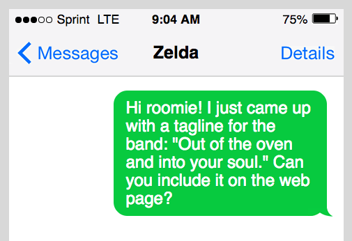
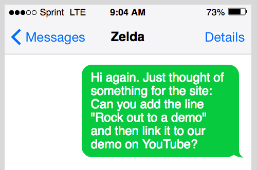
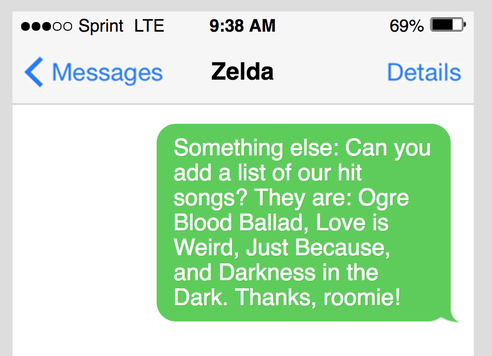
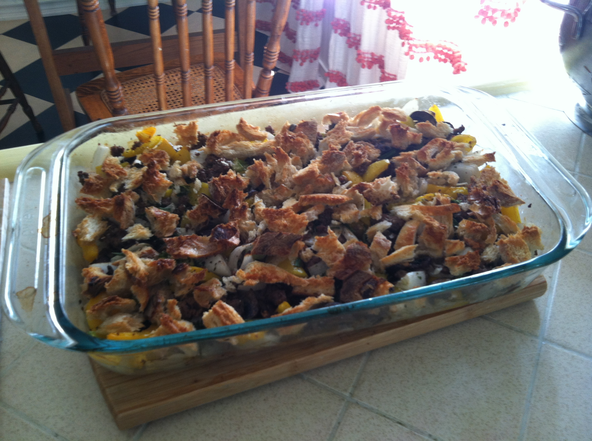

<textarea id="source">

<h1 class="slide-header">Adding Content to a Web Page</h1>

<span id=time-estimate class="color-grey-500">30 mins</span>

<p id="lesson-description">
  With templates like the HTML boilerplate, it’s easy to put the shell of an HTML file into place. But populating that page with content? That’s up to you. In this lesson, we’ll show you how.
</p>

<h5 id="topics-header" class="color-grey-500">Topics</h5>

Writing Text in HTML

<hr>

Adding Links in HTML

<hr>

Creating Lists in HTML

<hr>

Inserting Images in HTML

<hr>

<a href="./assets/adding_conent_to_a_web_page_study_guide.pdf" target="_blank" download="adding_conent_to_a_web_page_study_guide.pdf" class="ant-btn" data-trackable="true" data-track-category="study guide" data-track-section="lesson page" data-track-action="download study guide"><span role="img" class="anticon"><svg viewBox="0 0 16 16" width="1em" height="1em" fill="currentColor" aria-hidden="true" focusable="false" class=""><g class="download_svg__nc-icon-wrapper"><path d="M8 12c.3 0 .5-.1.7-.3L14.4 6 13 4.6l-4 4V0H7v8.6l-4-4L1.6 6l5.7 5.7c.2.2.4.3.7.3z"></path><path data-color="color-2" d="M1 14h14v2H1z"></path></g></svg></span><span> Download Study Guide</span></a>

---

<h1 class="slide-header">Learning Objectives</h1>

<p>By the end of this lesson, you'll be able to:</p>

<ul>
  <li>Add text elements to an HTML file.</li>
  <li>Add links to an HTML file.</li>
  <li>Add lists to an HTML file.</li>
  <li>Add images to an HTML file.</li>
</ul>

---

<h1 class="slide-header">Adding Headings</h1>

All websites should start with a heading — something that tells users what they’re seeing.

There are a series of these heading tags available, from `<h1>` through `<h6>`.  As the numbers increase, the text gets smaller. (Think about it this way: The `<h1>` is the most important element on the page, the `<h2>` is second-most important, and so on down the line.)


---

<h1 class="slide-header">Adding Zelda's Headings</h1>

Let’s pick up where we left off last lesson, when we added an `<h1>` to Zelda’s site — “Kasserole,” the name of the band.

Most sites should have **only one `<h1>` tag**, as it’s supposed to indicate the most important thing on the page. So, let’s add another heading below that. Maybe something to build up Zelda’s confidence about her new band?
  
Let’s use an `<h3>` tag, because we don’t need the copy to be quite as large as the `<h1>`. Add the text `Critics dub Kasserole the Metallica of modern times.`.
  
Remember to click the button to run our tests, which will confirm that your code is correct!

<iframe   sandbox="allow-scripts allow-top-navigation allow-top-navigation-by-user-activation allow-forms allow-popups allow-same-origin"  height="400" style="width: 100%;" scrolling="no" title="Adding Zelda's Headings" src="https://codepen.io/GAmarketing/embed/BaEQdxw?default-tab=html%2Cresult&editable=true" frameborder="no" loading="lazy" allowtransparency="true" allowfullscreen="true">
  See the Pen <a href="https://codepen.io/GAmarketing/pen/BaEQdxw">
  Adding Zelda's Headings</a> by General Assembly (<a href="https://codepen.io/GAmarketing">@GAmarketing</a>)
  on <a href="https://codepen.io">CodePen</a>.
</iframe>

---

<h1 class="slide-header">Adding More Text</h1>

Zelda’s been thinking about the new website, too. In fact, she just texted you the following request:



---

<h1 class="slide-header">The p tag</h1>

Let’s add Zelda’s new tagline to the page. We’ll place it in a `<p>`, or “paragraph,” tag, which adds text in a smaller, more standard size than heading tags. Think of the `<p>` tag as your default option for regular text.

Below the `<h1>` and `<h3>`, add a `<p>` that contains `Out of the oven and into your soul.`.

  <iframe   sandbox="allow-scripts allow-top-navigation allow-top-navigation-by-user-activation allow-forms allow-popups allow-same-origin"  height="400" style="width: 100%;" scrolling="no" title="The paragraph tag" src="https://codepen.io/GAmarketing/embed/yLrVojR?default-tab=html%2Cresult&editable=true" frameborder="no" loading="lazy" allowtransparency="true" allowfullscreen="true">
    See the Pen <a href="https://codepen.io/GAmarketing/pen/yLrVojR">
    The paragraph tag</a> by General Assembly (<a href="https://codepen.io/GAmarketing">@GAmarketing</a>)
    on <a href="https://codepen.io">CodePen</a>.
  </iframe>

---

<h1 class="slide-header">Another Message from Zelda</h1>

Looks like we’ve got another item to add! 



---

<h1 class="slide-header">Adding a Hyperlink</h1>

Let’s add that text and link it to the YouTube demo video.

Follow these steps:
1. After the tagline, add another paragraph opening tag (`<p>`).
2. Following the new `<p>` tag, add this exact code: `<a href="https://www.youtube.com/watch?v=vm32-ted2rI" target="_blank">Rock out to a demo.</a>` .
3. Add the closing paragraph tag.
4. Check the preview screen to see if the new text appears. The URL _itself_ shouldn’t be displayed, only the words “Rock out to a demo.” 

<iframe   sandbox="allow-scripts allow-top-navigation allow-top-navigation-by-user-activation allow-forms allow-popups allow-same-origin"  height="400" style="width: 100%;" scrolling="no" title="Adding a Hyperlink" src="https://codepen.io/GAmarketing/embed/XWQNaqQ?default-tab=html%2Cresult&editable=true" frameborder="no" loading="lazy" allowtransparency="true" allowfullscreen="true">
  See the Pen <a href="https://codepen.io/GAmarketing/pen/XWQNaqQ">
  Adding a Hyperlink</a> by General Assembly (<a href="https://codepen.io/GAmarketing">@GAmarketing</a>)
  on <a href="https://codepen.io">CodePen</a>.
</iframe>

That was easy enough to plug in, but what does the `<a>` tag mean? And what’s with that `href=`?

---

<h1 class="slide-header">The Anchor Element Tag</h1>

Here’s the element we added:


Let’s break it down.
* The `a` in the tag stands for **anchor**. An anchor tag is a means of linking to another place; either to a location on the same page or to a completely different website, like you’re doing here.
* The `href` stands for **hypertext reference**. This is the web address to which you are linking. 
* The `target` attribute is a finishing touch. It isn’t strictly necessary, but it’s good to include. Setting the `target` value to `“_blank”` tells the browser to open the destination page in a _new window or tab_. If we _don’t_ include a target element, when a user clicks on the link, the new site will open in the same window (and take them away from our page). We don’t want that!
* After the `target`, you can enter the **display text**, which the user will see on the page (instead of the long, messy hyperlink).

---

<h1 class="slide-header">Add Your Own Link</h1>

Your turn!

1. Add a new hyperlink to our HTML file inside of a new paragraph element. 
2. Link to `https://pitchfork.com/` using the display text “Check out our reviews on Pitchfork.” 
3. Make sure to set the target attribute to `_blank` so that your link opens in a new browser window.
4. Always remember to check the preview window to ensure that everything has rendered correctly!

<iframe   sandbox="allow-scripts allow-top-navigation allow-top-navigation-by-user-activation allow-forms allow-popups allow-same-origin"  height="400" style="width: 100%;" scrolling="no" title="Add Your Own Link" src="https://codepen.io/GAmarketing/embed/abxByGe?default-tab=html%2Cresult&editable=true" frameborder="no" loading="lazy" allowtransparency="true" allowfullscreen="true">
  See the Pen <a href="https://codepen.io/GAmarketing/pen/abxByGe">
  Add Your Own Link</a> by General Assembly (<a href="https://codepen.io/GAmarketing">@GAmarketing</a>)
  on <a href="https://codepen.io">CodePen</a>.
</iframe>

---

<h1 class="slide-header">Zelda's Newest Request</h1>

OK, so she wants a list of songs. Luckily, there’s an HTML element for that!



---

<h1 class="slide-header">Adding a List</h1>

To add that list of songs to the HTML file, follow these steps:

1. Add an `<h2>` element with a line containing the text `Song List`, and remember to use both opening and closing tags.
2. After the `<h2>`, add the list like so:

```HTML
<ul>
  <li>Ogre Blood Ballad</li>
  <li>Love is Weird</li>
  <li>Just Because</li>
  <li>Darkness in the Dark</li>
</ul>
```

<iframe   sandbox="allow-scripts allow-top-navigation allow-top-navigation-by-user-activation allow-forms allow-popups allow-same-origin"  height="400" style="width: 100%;" scrolling="no" title="Adding a List" src="https://codepen.io/GAmarketing/embed/JjVbyZj?default-tab=html%2Cresult&editable=true" frameborder="no" loading="lazy" allowtransparency="true" allowfullscreen="true">
  See the Pen <a href="https://codepen.io/GAmarketing/pen/JjVbyZj">
  Adding a List</a> by General Assembly (<a href="https://codepen.io/GAmarketing">@GAmarketing</a>)
  on <a href="https://codepen.io">CodePen</a>.
</iframe>

---

<h1 class="slide-header">The List Element</h1>

Notice how the list we added has a _parent element_ with four indented  _child elements_:

```HTML
<ul>
  <li>Ogre Blood Ballad</li>
  <li>Love is Weird</li>
  <li>Just Because</li>
  <li>Darkness in the Dark</li>
</ul>
```

* The `<ul>` tag in the parent element stands for **unordered list**, which is a list of things in no particular order. 
* The `<li>` in the child elements stands for **list item**. Each item gets its own set of `<li>` tags, which ensures that each item is listed on a separate line. 

**Note**: What’s the opposite of an _unordered_ list? An _ordered_ list! Numbered lists that follow a specific order use a different tag: `<ol>`. As you progress in your web development career, you’ll notice that `<ul>`s are more common than `<ol>`s.

---

<h1 class="slide-header">Knowledge Check</h1>

Let’s practice your list-making skills. Which of the following HTML code blocks would create a list like this one?

```
Types of cats:
1. Tuxedo
2. Burmese
3. Maine Coon
4. Calico
```

<fieldset>
  <legend>Please select one of the following</legend>
  
  <input type="radio" name="list-question" id="option1" value="option1" />
  <label for="option1">
    ```html
    <ul>
      <li>Types of cats:</li>
      <li>Tuxedo</li>
      <li>Burmese</li>
      <li>Maine Coon</li>
      <li>Calico</li>
    </ul>
    ```
  </label>
  <br />
  
  <input type="radio" name="list-question" id="option2" value="option2" />
  <label for="option2">
    ```html
    <p>Types of cats:</p>
    <ul>
      <li>1. Tuxedo</li>
      <li>2. Burmese</li>
      <li>3. Maine Coon</li>
      <li>4. Calico</li>
    </ul>
    ```
  </label>
  <br />
  
  <input type="radio" name="list-question" id="option3" value="option3" correct="true" />
  <label for="option3">
    ```html
    <p>Types of cats:</p>
    <ol>
      <li>Tuxedo</li>
      <li>Burmese</li>
      <li>Maine Coon</li>
      <li>Calico</li>
    </ol>
    ```
  </label>
  <br />

  <input type="radio" name="list-question" id="option4" value="option4" />
  <label for="option4">
    ```html
    <h2>Types of cats:</h2>
    <ul>
      <li>Tuxedo</li>
      <li>Burmese</li>
      <li>Maine Coon</li>
      <li>Calico</li>
    </ul>
    ```
  </label>
  <br />
  
</fieldset>

<button class="ant-btn ant-btn-primary multiple-choice-radio-submit">Submit Answer</button>


---

<h1 class="slide-header">Surprise, Zelda!</h1>

You’re not going to wait around for Zelda’s next text message. Instead, you’ll surprise her by adding something else to the HTML file: an **image**.

And not just _any_ image — a high-quality photo of tater tot casserole. (Get it? Kasserole?)



---

<h1 class="slide-header">Adding an Image</h1>

So, how will you do this? You can’t just pop _any_ old image right into the HTML file. It has to be hosted somewhere online so that you can reference a specific **URL**, or web address, to link to it.

On a new line, below the closing tag for your list (`</ul>`), add the following code: ``.

That’s a hefty bit of code, huh? We’ll review each part on the next slide.

<iframe   sandbox="allow-scripts allow-top-navigation allow-top-navigation-by-user-activation allow-forms allow-popups allow-same-origin"  height="400" style="width: 100%;" scrolling="no" title="Adding an Image" src="https://codepen.io/GAmarketing/embed/YzMpxvW?default-tab=html%2Cresult&editable=true" frameborder="no" loading="lazy" allowtransparency="true" allowfullscreen="true">
  See the Pen <a href="https://codepen.io/GAmarketing/pen/YzMpxvW">
  Adding an Image</a> by General Assembly (<a href="https://codepen.io/GAmarketing">@GAmarketing</a>)
  on <a href="https://codepen.io">CodePen</a>.
</iframe>

---

<h1 class="slide-header">HTML Image Attributes: img tag</h1>


```html

```

Like any element, the image element has a tag. As you surely guessed, `img` stands for image. 

Notice that the `` tag doesn’t have a full closing tag like the others we’ve defined so far. This is one of several “self-closing” HTML tags. It closes itself when we add a `/>` at the end of a statement.

---

<h1 class="slide-header">src</h1>

```HTML

```

`src` stands for **source**, as in where the image comes from. This is usually a URL. In the case of your casserole picture, the URL is `https://bit.ly/2FsuPLG`.

---

<h1 class="slide-header">alt</h1>

```HTML

```

The `alt` stands for **alternative text**, commonly called “alt text.” Some of your page’s visitors may be visually impaired or won’t be able to see the casserole image. Alt text is used to help indicate content for those viewers. In this case, a screen reader would say, “Tater Tot Casserole.”

---

<h1 class="slide-header">width and height</h1>

```HTML

```

These specify the image’s width and height in pixels. The original image was much too large (2592x1936), so you reduced it proportionally. You can add these in the HTML tag, like we did here, or in your CSS, which we’ll learn about in a future lesson.

---

<h1 class="slide-header">Conclusion</h1>

Wow, the heavy metal band website you’ve been working on has come a long way! Let’s review what you’ve accomplished:

* You added text, including paragraphs (`<p>`) and headings (`<h1-h6>`).
* You added two hyperlinks with the `<a>` tag, which — when clicked — open new browser windows.
* You added an unordered list of songs with a `<ul>` and `<li>`s.
* And finally, you added an image (``) of a tasty looking tater tot casserole.

That’s a lot! 

</textarea>
